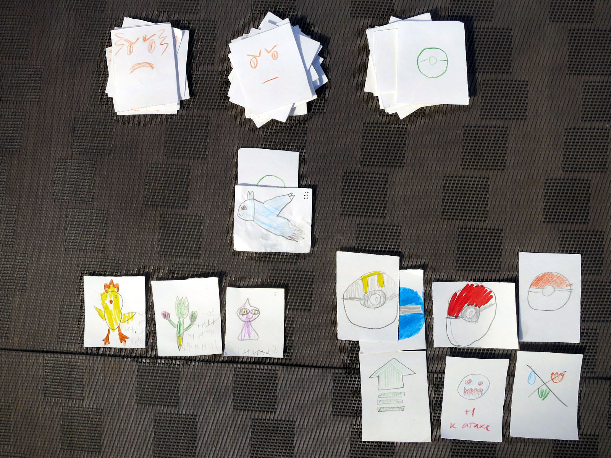

## Preparing

For the game you would need a d6 dice (or an app like
[this one](https://play.google.com/store/apps/details?id=com.ccp.rpgsimpledice)),
a graphite and coloured pencils, and few sheets of thick white paper.
A repeat game would require an eraser to remove old markings.

First you need to draw cards. It is an important part of the game: children
would like to remeber or invent creatures, and make their own, not ready-bought,
cards.

* 20+ regular pokemon cards
* 5+ legendary pokemon cards
* 10+ pokeball cards
* 10+ other item cards (see the list below)

In total, 45 cards at the least: two sheets of A4 paper should be enough,
cut 4×6 into squares. Though you'd do better with 4-5 sheets.

On the flipside you would need to mark regular and legendary pokemon,
and all the items (pokeballs and others alike). Come up with simple markings
and quickly mark all the cards' flipsides.

Every regular pokemon card should have dots corresponding to its
[Catch Rate](https://bulbapedia.bulbagarden.net/wiki/List_of_Pok%C3%A9mon_by_catch_rate)
(we look it up in a [Pokedex app](https://play.google.com/store/apps/details?id=com.goldex)),
according to the table:

| 255  | 1 |
| 200+ | 2 |
| 130+ | 3 |
| 90+  | 4 |
| 45+  | 5 |
| 1+   | 6 |

Legendary pokemon always have 7, you don't need to draw these.
For invented pokemon, roll a dice.

## Game Start

Players receive one starter pokemon each (either special or a regular one)
of level 1, and 1-2 pokeballs. A player can have any number of pokemon
stored away, and only three in the game. They can swap pokemon outside a battle
at any time. One can have any number of items.

## Turn

Open a regular (wild) pokemon card and roll a d6 dice to find its level using
the table below. A denotes a level of the weakest pokemon in battle, and Z is
a level of the strongest one. The minimum level is obviously 1.

| 1 | A–1 |
| 2 | A   |
| 3 | A+1 |
| 4 | Z–1 |
| 5 | Z   |
| 6 | Z+1 |

To complicate the game a little, use 4=A+2, 5=Z–1, 6=Z.

Now the battle: roll the dice again.

| Level of a player's pokemon compared to N, level of wild pokemon | Number on the dice to win |
|-------------|----|
| N+2 or more | auto win |
| N+1         | 2+ |
| N           | 4+ |
| N–1         | 6  |
| N–2 or less | auto loss |

When lost, a pokemon faints and skips the next battle.
Another player's pokemon enters the battle — and the opposing pokemon loses a level
with each fight. That is, a level 7 pokemon defeats a player's pokemon and fights
the next one — but now with level of 6. The level can fall to 0, but not -1.

A player can run at any time. When escaped or lost, the wild pokemon should be
shuffled back into the deck.

### After a Battle

При победе игрок берёт карточку предмета (можно использовать только со следующего хода)
и ставит чёрточку на всех покемонах, участвовавших в битве (и только них:
если покемон отсиживался, чёрточки не получает). Три чёрточки — плюс уровень.

Если разница между силой покемонов в битве 3 и больше — то ставим две чёрточки.
6 — три, 9 — четыре и так далее.

### Catching a Pokémon

После боя можно кинуть покебол и попытаться поймать покемона. Для поимки нужно кинуть кубик
и чтобы результат был не меньше, чем число точек на карточке. Если покемон не побеждён, нужно выкинуть на один больше.

Например, если легендарный покемон не побеждён, то нужно выкинуть 8 и больше.
Используя ультрабол, достаточно выкинуть 6. Если победить этого покемона, то нужны 5 или 6.
Наконец, добавив карту «+2 к поимке», для ловли ультраболом побеждённого легендарного покемона
достаточно выкинуть 3 или выше — вероятность поимки 67%.

Можно кидать несколько покеболов, если первые не сработали.

Пойманному покемону нужно отметить базовый уровень — который выпал ему перед боем.
Если не хочется потом стирать пометки, можно придумать какие-нибудь конвертики.

## Legendary Pokémon

When the strongest pokemon in game reaches level 10, legendary pokemon can appear.
They suddensly replace a wild pokemon on the field, when a dice roll for power
shows 1, and the last pokemon wasn't legendary. Alternatively, you can open
a legendary pokemon every 6 turns, or by request.

A level of a legendary pokemon is d6+Z, where Z is the level of the strongest
pokemon in the battle.

## Goal

The game ends whenever. You can set a deadline (the game tends to last)
or set a goal of catching a specific legendary pokemon.

## Pokémon and Items

Types of pokeballs:

* pokeball
* masterball (always succeeds and then leaves the deck)
* ultraball (+2)
* all other types (+1)

Types of items:

* +1 to attack (once a fight)
* +2 to catching (for one pokemon)
* level up (дорисовываем чёрточки до уровня; once outside a battle)
* double (doubles the pokemon level)
* scare the pokemon away (during a battle; it leaves an item)

All battle items can be used simultaneously: for example, you can boost a pokemon
with three cards "+1 to attach" at once. After using, shuffle them into the deck.

## Modifications

### Pokémon Types

У покемонов обычно есть тип: например, электрический. Можно для карт ограничиться набором из трёх-пяти:
вода, огонь, трава, воздух. Или взять [набор из TCG](https://en.wikipedia.org/wiki/Pok%C3%A9mon_Trading_Card_Game#Pok%C3%A9mon_types),
но тогда придётся каждый раз сверяться с таблицей взаимодействий.

Покемон, у которого тип сильнее того, что играет против него, получает +1 к силе во время боя.

В карты предметов добавляем «убрать тип»: он снимает бонус за тип в одном бою.

### Multiple Players

Когда играют два и более игроков, они тащат покемонов по очереди. Можно меняться
предметами вне боя. Если новый игрок вступает в середине игры, игроки должны
дать ему покемона и покебол из своих.

Игроки могут биться между собой. Они выставляют предметы, которые получит победитель.
Затем каждый побеждает самого сильного покемона противника. Затем второго по силе
и так далее, пока все покемоны одного из игроков не будут в обмороке: он и проиграл.
Первым ходит тот, кому предложили биться, либо по договорённости.

### Playing Outside

Можно не сидеть над колодой, а спрятать покемонов на улице. Возможно распределить их
тематически: например, по типам или размерам. С ними прячем и предметы — возможно, по два:
покебол + предмет. Участники тогда сами их находят и дерутся, кидая кубики.
Целью можно поставить, например, поймать всех покемонов.

## Addendums

### Pokémon Level Table

Используем формулу из раздела «Ход»:

| в колоде | 1 | 2 | 3 | 4 | 5 | 6 |
|----------|---|---|---|---|---|---|
| 1—1      | 1 | 1 | 2 | 1 | 1 | 2 |
| 1—2      | 1 | 1 | 2 | 1 | 2 | 3 |
| 1—3      | 1 | 1 | 2 | 2 | 3 | 4 |
| 1—4      | 1 | 1 | 2 | 3 | 4 | 5 |
| 2—2      | 1 | 2 | 3 | 1 | 2 | 3 |
| 2—3      | 1 | 2 | 3 | 2 | 3 | 4 |
| 2—4      | 1 | 2 | 3 | 3 | 4 | 5 |
| 3—3      | 2 | 3 | 4 | 2 | 3 | 4 |
| 3—4      | 2 | 3 | 4 | 3 | 4 | 5 |
| 4—4      | 3 | 4 | 5 | 3 | 4 | 5 |

Для альтернативной формулы с A+2:

| в колоде | 1 | 2 | 3 | 4 | 5 | 6 |
|----------|---|---|---|---|---|---|
| 1—1      | 1 | 1 | 2 | 3 | 1 | 1 |
| 1—2      | 1 | 1 | 2 | 3 | 1 | 2 |
| 1—3      | 1 | 1 | 2 | 3 | 2 | 3 |
| 1—4      | 1 | 1 | 2 | 3 | 3 | 4 |
| 2—2      | 1 | 2 | 3 | 4 | 1 | 2 |
| 2—3      | 1 | 2 | 3 | 4 | 2 | 3 |
| 2—4      | 1 | 2 | 3 | 4 | 3 | 4 |
| 3—3      | 2 | 3 | 4 | 5 | 2 | 3 |
| 3—4      | 2 | 3 | 4 | 5 | 3 | 4 |
| 4—4      | 3 | 4 | 5 | 6 | 3 | 4 |

### History

The rules above describe version 1.0 of the game.
Changes from older versions will be documented here.

## Authors

All rights for images, pokémon names and the "Pokémon" word itself belong to The Pokémon Company.

Everything else here is published under CC0 license. Idea by Ilya Zverev, with improvements by other people.
