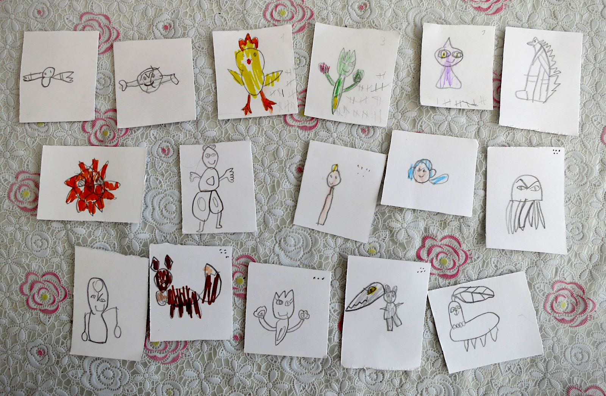

## Preparing

For the game you would need a d6 dice (or an app like
[this one](https://play.google.com/store/apps/details?id=com.ccp.rpgsimpledice)),
a graphite and coloured pencils, and few sheets of thick white paper.
A repeat game would require an eraser to remove old markings.

First you need to draw cards. It is an important part of the game: children
would like to remeber or invent creatures, and make their own, not ready-bought,
cards.

* 20+ regular pokemon cards
* 5+ legendary pokemon cards
* 10+ pokeball cards
* 10+ other item cards (see the list below)

In total, 45 cards at the least: two sheets of A4 paper should be enough,
cut 4×6 into squares. Though you'd do better with 4-5 sheets.

On the flipside you would need to mark regular and legendary pokemon,
and all the items (pokeballs and others alike). Come up with simple markings
and quickly mark all the cards' flipsides.

Every regular pokemon card should have dots corresponding to its
[Catch Rate](https://bulbapedia.bulbagarden.net/wiki/List_of_Pok%C3%A9mon_by_catch_rate)
(we look it up in a [Pokedex app](https://play.google.com/store/apps/details?id=com.goldex)),
according to the table:

| 255  | 1 |
| 200+ | 2 |
| 130+ | 3 |
| 90+  | 4 |
| 45+  | 5 |
| 1+   | 6 |

Legendary pokemon always have 7, you don't need to draw these.
For invented pokemon, roll a dice.

## Game Start

Игрокам выдаётся по одному стартовому покемону (специальному или из нормальных)
с силой 1 и по 1-2 покебола. У игрока может быть сколько угодно покемонов
в запасе и только три в игре. Менять их можно вне боя когда угодно.
Предметов может быть сколько угодно.

## Turn

Открываем покемона и кидаем кубик d6, чтобы определить его силу по таблице.
В ней A — сила самого слабого покемона у игрока в бою, а Z — самого сильного. Очевидно, минимум — 1.

| 1 | A–1 |
| 2 | A   |
| 3 | A+1 |
| 4 | Z–1 |
| 5 | Z   |
| 6 | Z+1 |

Для небольшого усложнения игры можно использовать 4=A+2, 5=Z–1, 6=Z.

Теперь бой: снова кидаем кубик. Таблица победы такая:

| Сила покемона игрока относительно N — силы покемона на столе | Сколько нужно выкинуть на кубике, чтобы победить |
|--------------|----|
| N+2 и больше | победа автоматом |
| N+1          | 2+ |
| N            | 4+ |
| N–1          | 6  |
| N–2 и меньше | проигрыш автоматом |

При проигрыше покемон теряет сознание и пропускает следующую битву.
В бой вступает следующий покемон игрока — но покемон на поле с каждой битвой теряет одно очко силы.
То есть, покемон 7 уровня после победы над покемоном игрока бьётся со следующим,
но уже с силой 6. Сила может быть 0 и не может быть -1.

В любое время можно сбежать. При побеге или проигрыше прячем покемона с поля в колоду.

### After a Battle

При победе игрок берёт карточку предмета (можно использовать только со следующего хода)
и ставит чёрточку на всех покемонах, участвовавших в битве (и только них:
если покемон отсиживался, чёрточки не получает). Три чёрточки — плюс уровень.

Если разница между силой покемонов в битве 3 и больше — то ставим две чёрточки.
6 — три, 9 — четыре и так далее.

### Catching a Pokémon

После боя можно кинуть покебол и попытаться поймать покемона. Для поимки нужно кинуть кубик
и чтобы результат был не меньше, чем число точек на карточке. Если покемон не побеждён, нужно выкинуть на один больше.

Например, если легендарный покемон не побеждён, то нужно выкинуть 8 и больше.
Используя ультрабол, достаточно выкинуть 6. Если победить этого покемона, то нужны 5 или 6.
Наконец, добавив карту «+2 к поимке», для ловли ультраболом побеждённого легендарного покемона
достаточно выкинуть 3 или выше — вероятность поимки 67%.

Можно кидать несколько покеболов, если первые не сработали.

Пойманному покемону нужно отметить базовый уровень — который выпал ему перед боем.
Если не хочется потом стирать пометки, можно придумать какие-нибудь конвертики.

## Legendary Pokémon

Когда старший покемон достигает 10 уровня, в игру вступают легендарные покемоны.
Они внезапно подменяют покемона на столе, когда при оценке силы выпадает 1 и прошлый покемон не был легендарным.
Как вариант, можно их выкладывать каждые 6 ходов или по запросу.

Сила легендарного покемона равна d6+Z, где Z — сила самого сильного покемона у игрока.

## Goal

Игра заканчивается когда угодно. Как вариант, можно ограничить время (игра затягивается!)
или поставить цель поймать особенного легендарного покемона.

## Pokémon and Items

Какие бывают покеболы:

* покебол
* мастербол (ловит всегда и уходит из колоды после использования)
* ультрабол (+2)
* все остальные виды (+1)

Какие бывают предметы:

* +1 к атаке (один раз во время боя)
* +2 к поимке (на одного покемона)
* level up (дорисовываем чёрточки до уровня; один раз вне боя)
* дубль (сила покемона удваивается)
* прогнать покемона (во время боя; остаётся item)

Все предметы во время боя можно использовать много раз: например, «навесить» на атакующего покемона
сразу три карточки «+1 к атаке». После использования они все возвращаются в колоду.

## Modifications

### Pokémon Types

У покемонов обычно есть тип: например, электрический. Можно для карт ограничиться набором из трёх-пяти:
вода, огонь, трава, воздух. Или взять [набор из TCG](https://en.wikipedia.org/wiki/Pok%C3%A9mon_Trading_Card_Game#Pok%C3%A9mon_types),
но тогда придётся каждый раз сверяться с таблицей взаимодействий.

Покемон, у которого тип сильнее того, что играет против него, получает +1 к силе во время боя.

В карты предметов добавляем «убрать тип»: он снимает бонус за тип в одном бою.

### Multiple Players

Когда играют два и более игроков, они тащат покемонов по очереди. Можно меняться
предметами вне боя. Если новый игрок вступает в середине игры, игроки должны
дать ему покемона и покебол из своих.

Игроки могут биться между собой. Они выставляют предметы, которые получит победитель.
Затем каждый побеждает самого сильного покемона противника. Затем второго по силе
и так далее, пока все покемоны одного из игроков не будут в обмороке: он и проиграл.
Первым ходит тот, кому предложили биться, либо по договорённости.

### Playing Outside

Можно не сидеть над колодой, а спрятать покемонов на улице. Возможно распределить их
тематически: например, по типам или размерам. С ними прячем и предметы — возможно, по два:
покебол + предмет. Участники тогда сами их находят и дерутся, кидая кубики.
Целью можно поставить, например, поймать всех покемонов.

## Addendums

### Pokémon Power Table

Используем формулу из раздела «Ход»:

| в колоде | 1 | 2 | 3 | 4 | 5 | 6 |
|----------|---|---|---|---|---|---|
| 1—1      | 1 | 1 | 2 | 1 | 1 | 2 |
| 1—2      | 1 | 1 | 2 | 1 | 2 | 3 |
| 1—3      | 1 | 1 | 2 | 2 | 3 | 4 |
| 1—4      | 1 | 1 | 2 | 3 | 4 | 5 |
| 2—2      | 1 | 2 | 3 | 1 | 2 | 3 |
| 2—3      | 1 | 2 | 3 | 2 | 3 | 4 |
| 2—4      | 1 | 2 | 3 | 3 | 4 | 5 |
| 3—3      | 2 | 3 | 4 | 2 | 3 | 4 |
| 3—4      | 2 | 3 | 4 | 3 | 4 | 5 |
| 4—4      | 3 | 4 | 5 | 3 | 4 | 5 |

Для альтернативной формулы с A+2:

| в колоде | 1 | 2 | 3 | 4 | 5 | 6 |
|----------|---|---|---|---|---|---|
| 1—1      | 1 | 1 | 2 | 3 | 1 | 1 |
| 1—2      | 1 | 1 | 2 | 3 | 1 | 2 |
| 1—3      | 1 | 1 | 2 | 3 | 2 | 3 |
| 1—4      | 1 | 1 | 2 | 3 | 3 | 4 |
| 2—2      | 1 | 2 | 3 | 4 | 1 | 2 |
| 2—3      | 1 | 2 | 3 | 4 | 2 | 3 |
| 2—4      | 1 | 2 | 3 | 4 | 3 | 4 |
| 3—3      | 2 | 3 | 4 | 5 | 2 | 3 |
| 3—4      | 2 | 3 | 4 | 5 | 3 | 4 |
| 4—4      | 3 | 4 | 5 | 6 | 3 | 4 |

## Authors

All rights for images, pokémon names and the "Pokémon" word itself belong to The Pokémon Company.

Everything else here is published under CC0 license. Idea by Ilya Zverev, with improvements by other people.
