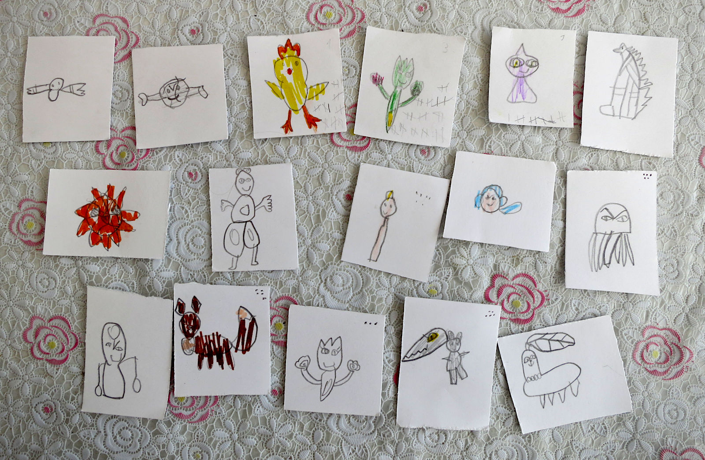
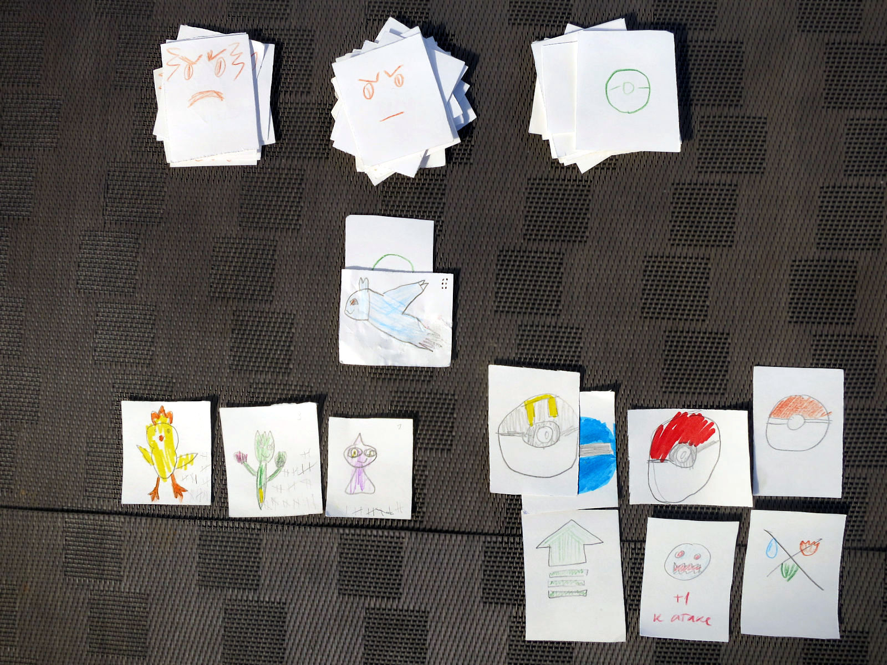
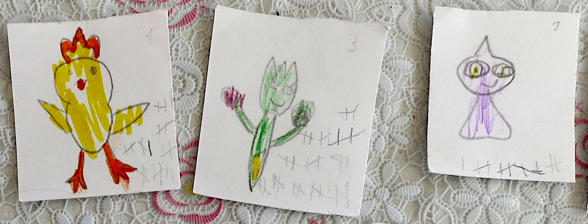
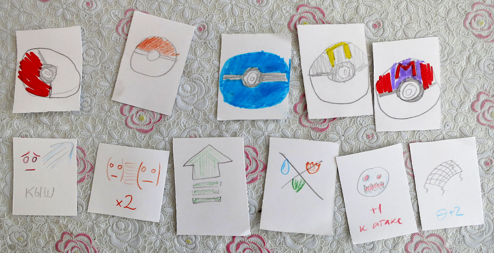

## Подготовка

Для игры понадобится кубик d6
(или приложение типа [этого](https://play.google.com/store/apps/details?id=com.ccp.rpgsimpledice)),
простой и цветные карандаши и чистая бумага, желательно плотная.
Повторная игра потребует стирательной резинки, чтобы удалить старые пометки.

Сначала нужно нарисовать карточки. Это важная часть игры: детям понравится
вспоминать или придумывать существ и делать собственные, не покупные, карточки.

* 20+ карт обычных покемонов
* 5+ карт легендарных покемонов
* 10+ карт покеболлов
* 10+ карт других предметов (список см. внизу)

Итого, 45 карт минимум: двух листов картона А4, разделённого на квадратики 4×6,
должно хватить. Но лучше взять 4-5 листов.

На обороте нужно различить обычных и легендарных покемонов,
а также все предметы (покеболы и обычные не разделяем). Придумайте простые
обозначения и быстро пометьте все карточки.

На карте каждого обычного покемона обязательно нарисовать точечки
по его [Catch Rate](https://bulbapedia.bulbagarden.net/wiki/List_of_Pok%C3%A9mon_by_catch_rate)
(мы смотрим в приложении [Pokedex](https://play.google.com/store/apps/details?id=com.goldex)),
см. таблицу:

| 255  | 1 |
| 200+ | 2 |
| 130+ | 3 |
| 90+  | 4 |
| 45+  | 5 |
| 1+   | 6 |

У легендарных всегда 7, можно не рисовать. Если покемон выдуманный, то бросайте кубик.

## Начало игры

Игрокам выдаётся по одному стартовому покемону (специальному или из нормальных)
с силой 1 и по 1-2 покебола. У игрока может быть сколько угодно покемонов
в запасе и только три в игре. Менять их можно вне боя когда угодно.
Предметов может быть сколько угодно.

## Ход

Открываем покемона и кидаем кубик d6, чтобы определить его силу по таблице.
В ней A — сила самого слабого покемона у игрока в бою, а Z — самого сильного. Очевидно, минимум — 1.

| 1 | A–1 |
| 2 | A   |
| 3 | A+1 |
| 4 | Z–1 |
| 5 | Z   |
| 6 | Z+1 |

Для небольшого усложнения игры можно использовать 4=A+2, 5=Z–1, 6=Z.

Теперь бой: снова кидаем кубик. Таблица победы такая:

| Сила покемона игрока относительно N — силы покемона на столе | Сколько нужно выкинуть на кубике, чтобы победить |
|--------------|----|
| N+2 и больше | победа автоматом |
| N+1          | 2+ |
| N            | 4+ |
| N–1          | 6  |
| N–2 и меньше | проигрыш автоматом |

При проигрыше покемон теряет сознание и пропускает следующую битву.
В бой вступает следующий покемон игрока — но покемон на поле с каждой битвой теряет одно очко силы.
То есть, покемон 7 уровня после победы над покемоном игрока бьётся со следующим,
но уже с силой 6. Сила может быть 0 и не может быть -1.

В любое время можно сбежать. При побеге или проигрыше прячем покемона с поля в колоду.

### После боя

При победе игрок берёт карточку предмета (можно использовать только со следующего хода)
и ставит чёрточку на всех покемонах, участвовавших в битве (и только них:
если покемон отсиживался, чёрточки не получает). Три чёрточки — плюс уровень.

Если разница между силой покемонов в битве 3 и больше — то ставим две чёрточки.
6 — три, 9 — четыре и так далее.

### Ловим покемона

После боя можно кинуть покебол и попытаться поймать покемона. Для поимки нужно кинуть кубик
и чтобы результат был не меньше, чем число точек на карточке. Если покемон не побеждён, нужно выкинуть на один больше.

Например, если легендарный покемон не побеждён, то нужно выкинуть 8 и больше.
Используя ультрабол, достаточно выкинуть 6. Если победить этого покемона, то нужны 5 или 6.
Наконец, добавив карту «+2 к поимке», для ловли ультраболом побеждённого легендарного покемона
достаточно выкинуть 3 или выше — вероятность поимки 67%.

Можно кидать несколько покеболов, если первые не сработали.

Пойманному покемону нужно отметить базовый уровень — который выпал ему перед боем.
Если не хочется потом стирать пометки, можно придумать какие-нибудь конвертики.

## Легендарные покемоны

Когда старший покемон достигает 10 уровня, в игру вступают легендарные покемоны.
Они внезапно подменяют покемона на столе, когда при оценке силы выпадает 1 и прошлый покемон не был легендарным.
Как вариант, можно их выкладывать каждые 6 ходов или по запросу.

Сила легендарного покемона равна d6+Z, где Z — сила самого сильного покемона у игрока.

## Цель игры

Игра заканчивается когда угодно. Как вариант, можно ограничить время (игра затягивается!)
или поставить цель поймать особенного легендарного покемона.

## Покеболы и предметы

Какие бывают покеболы:

* покебол
* мастербол (ловит всегда и уходит из колоды после использования)
* ультрабол (+2)
* все остальные виды (+1)

Какие бывают предметы:

* +1 к атаке (один раз во время боя)
* +2 к поимке (на одного покемона)
* level up (дорисовываем чёрточки до уровня; один раз вне боя)
* дубль (сила покемона удваивается)
* прогнать покемона (во время боя; остаётся item)

Все предметы во время боя можно использовать много раз: например, «навесить» на атакующего покемона
сразу три карточки «+1 к атаке». После использования они все возвращаются в колоду.

## Дополнения

### Типы покемонов

У покемонов обычно есть тип: например, электрический. Можно для карт ограничиться набором из трёх-пяти:
вода, огонь, трава, воздух. Или взять [набор из TCG](https://en.wikipedia.org/wiki/Pok%C3%A9mon_Trading_Card_Game#Pok%C3%A9mon_types),
но тогда придётся каждый раз сверяться с таблицей взаимодействий.

Покемон, у которого тип сильнее того, что играет против него, получает +1 к силе во время боя.

В карты предметов добавляем «убрать тип»: он снимает бонус за тип в одном бою.

### Два и более игроков

Когда играют два и более игроков, они тащат покемонов по очереди. Можно меняться
предметами вне боя. Если новый игрок вступает в середине игры, игроки должны
дать ему покемона и покебол из своих.

Игроки могут биться между собой. Они выставляют предметы, которые получит победитель.
Затем каждый побеждает самого сильного покемона противника. Затем второго по силе
и так далее, пока все покемоны одного из игроков не будут в обмороке: он и проиграл.
Первым ходит тот, кому предложили биться, либо по договорённости.

### В поле

Можно не сидеть над колодой, а спрятать покемонов на улице. Возможно распределить их
тематически: например, по типам или размерам. С ними прячем и предметы — возможно, по два:
покебол + предмет. Участники тогда сами их находят и дерутся, кидая кубики.
Целью можно поставить, например, поймать всех покемонов.

## Приложения

### Таблица сил покемона

Используем формулу из раздела «Ход»:

| в бою | 1 | 2 | 3 | 4 | 5 | 6 |
|-------|---|---|---|---|---|---|
| 1—1   | 1 | 1 | 2 | 1 | 1 | 2 |
| 1—2   | 1 | 1 | 2 | 1 | 2 | 3 |
| 1—3   | 1 | 1 | 2 | 2 | 3 | 4 |
| 1—4   | 1 | 1 | 2 | 3 | 4 | 5 |
| 2—2   | 1 | 2 | 3 | 1 | 2 | 3 |
| 2—3   | 1 | 2 | 3 | 2 | 3 | 4 |
| 2—4   | 1 | 2 | 3 | 3 | 4 | 5 |
| 3—3   | 2 | 3 | 4 | 2 | 3 | 4 |
| 3—4   | 2 | 3 | 4 | 3 | 4 | 5 |
| 4—4   | 3 | 4 | 5 | 3 | 4 | 5 |

Для альтернативной формулы с A+2:

| в бою | 1 | 2 | 3 | 4 | 5 | 6 |
|-------|---|---|---|---|---|---|
| 1—1   | 1 | 1 | 2 | 3 | 1 | 1 |
| 1—2   | 1 | 1 | 2 | 3 | 1 | 2 |
| 1—3   | 1 | 1 | 2 | 3 | 2 | 3 |
| 1—4   | 1 | 1 | 2 | 3 | 3 | 4 |
| 2—2   | 1 | 2 | 3 | 4 | 1 | 2 |
| 2—3   | 1 | 2 | 3 | 4 | 2 | 3 |
| 2—4   | 1 | 2 | 3 | 4 | 3 | 4 |
| 3—3   | 2 | 3 | 4 | 5 | 2 | 3 |
| 3—4   | 2 | 3 | 4 | 5 | 3 | 4 |
| 4—4   | 3 | 4 | 5 | 6 | 3 | 4 |

### История

Правила выше описывают версию игры 1.0.
История правок будет в этом разделе.

## Авторы

Все права на изображения и названия покемонов, а также само слово «покемон» принадлежат The Pokémon Company.

Остальное на этом сайте опубликовано под лицензией CC0. Автор идеи — Илья Зверев, с дополнениями других участников.
